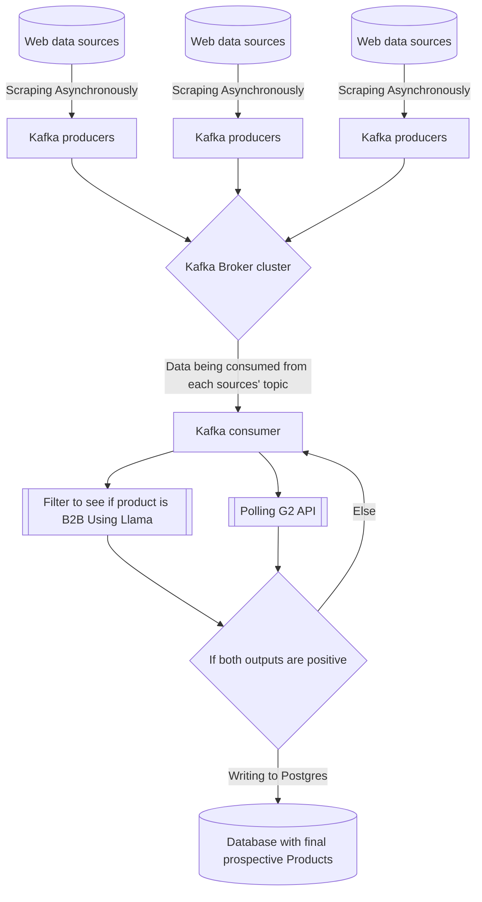

# G2_P1_MD
> [!NOTE]  
> need a .env file with your llm api key (default OPEN-AI) and G2 API Secret


_**This repository contains the submission of Team MD (Darsh Agarwal-PES1UG21CS166, B Monish Moger- PES1UG21CS129) for G2 PES University hackathon 2024**_

# S.I.F.S - Scrape Internet Filter Store

## Introduction 
The code in this repository solves the task of querying the *list of B2B products* that are have become *Generally available* and are **not** *listed on G2*, on a periodic scale.

## Architecture
We have developed an **Asynchronous** call based scraping architecture. 
- The raw scraping data is passed through a message stream funnelling it through an _intelligent filter_.
- The message stream writes this data to a database from which the final products list can be extracted.
- This process is periodically done (daily, weekly, monthly).



_**This whole architecture is dockerised and can be run on any system!!!**_

### Technologies leveraged:
- **Kafka** for pipelining data and message streaming
- **Zookeeper** for managing the kafka cluster
- **AsynchIO** for working with asynchronous functions
- **Python Requests** and API libraries from python for working with various APIs (verifying the availibility of a product on G2) and scraping applications
- **llama_index** to make a judgement on the product being B2B or not based on the description, announcements, posts, tweets or any unstructured data related to the product
- **PostgresSQL** to store the final filtered items and eventually collect data from this.
- Docker, DockerHub to containerise the whole cluster and services to ensure the product can be run on any Docker enabled platform.

## Advantages
- Utilising **llama_index** to create a specific data source for each product, and judge it to be B2B or not. This will enable contemporary **product announcements on Twitter and LinkedIn to also be handled** if given their APIs to be successfully analysed and added to the database.
- By employing a Kafka cluster, we **streamline the flow of data messages from various scraping sources** to our consumer. This architecture is hence **source independent**, enabling the **routing of any source to a relevant data consumer** within the same framework. Kafka thus **facilitates seamless scalability**.
- Instead of using sequential synchronous functions that rely on recieving response to proceed, we are using **asynchronous functions to poll the api and scrapers, to parallelly execute the requests**, thereby **accelerating the process**.

## How to run
Prerequisites:
- You should have [Cron](https://cron-job.org/en/) installed
- You should have [Docker](https://www.docker.com) installed
- You should have a [Python](https://www.python.org) installed
1. Clone the repository ``` git clone [Repository-Name] ```
2. Compose the docker compose file in the repository folder ```docker compose up```
3. Install all the packages using ```pip install -r requirements.txt```
4. Run main.py  ```Python main.py```


